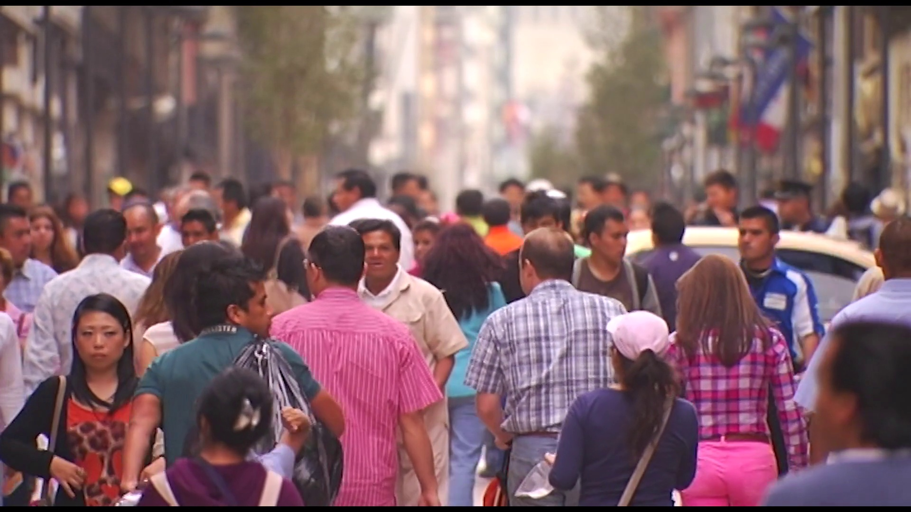
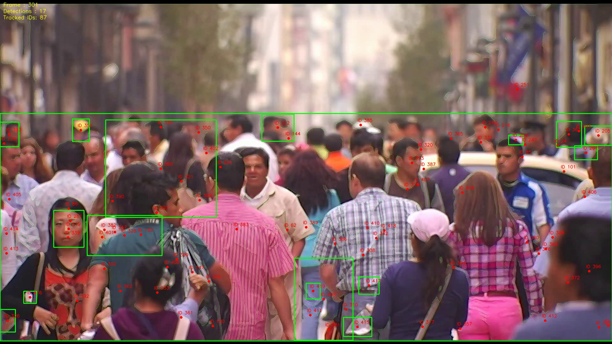
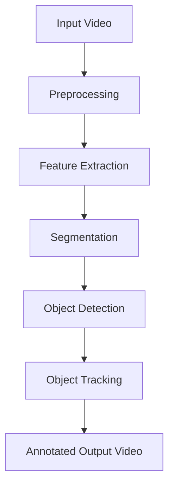
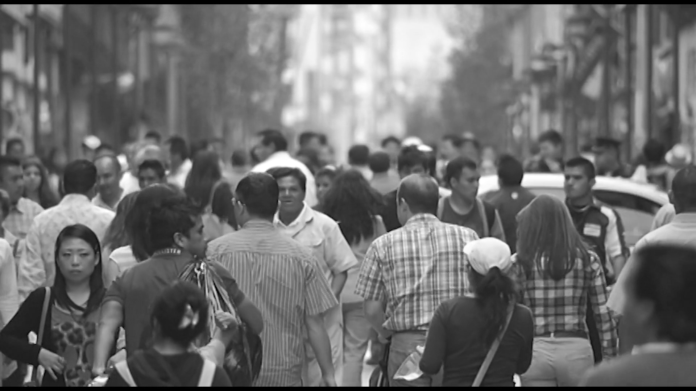
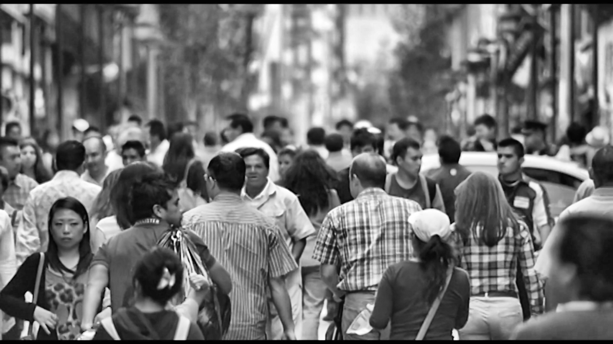
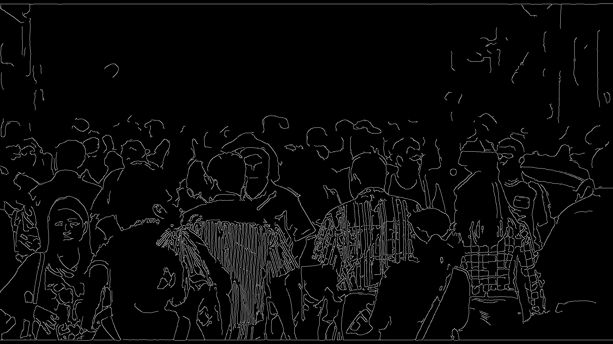
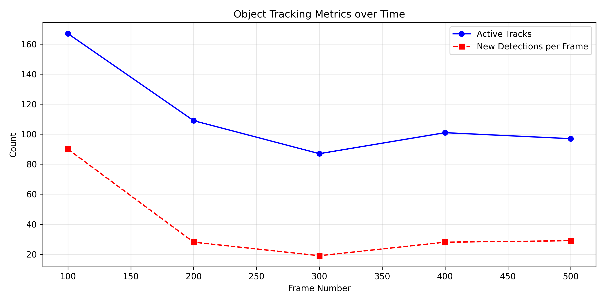
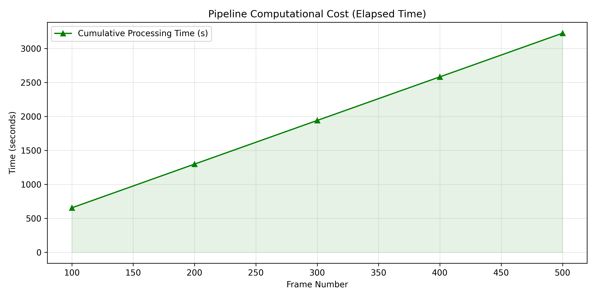

# 👁️ Smart Video Surveillance Pipeline
**A Multi-Stage Classical Computer Vision Engine for Real-Time Object Tracking**


This repository serves both as the **codebase** and the **technical report** for a multi-stage, GUI-free, CLI-driven computer vision pipeline. Rather than relying on computationally heavy deep-learning frameworks (like YOLO or PyTorch), this system implements **Classical CV Algorithms** natively to perform motion detection, adaptive background subtraction, and persistent centroid-tracking across HD video frames on standard CPU hardware.

---

## 🎬 Before & After

The pipeline takes chaotic, noisy raw video feeds and extracts rigorous structural and tracking geometry.

| **Raw Input Frame** | **Annotated Output Frame** |
|:---:|:---:|
|  |  |
| *Noisy 1080p source video containing unstructured motion.* | *Detected entities strictly bound in green boxes, with temporal ID tracking (red dots) and underlying Canny structural overlays.* |

---

## 🧠 System Architecture & Methodology

The pipeline processes video sequentially into 5 distinct mathematical stages. Each stage refines the optical data mathematically before passing it to the next module.



### 1. Preprocessing (`src/stages/preprocessing.py`)
Raw RGB data is heavily corrupted by sensor noise and varying lighting. Submitting raw data to differentiation engines guarantees failure. The preprocessing chain stabilizes the environment:
1. **Grayscale**: Reduces 3D $T \in \mathbb{R}^{H \times W \times 3}$ tensor down to 2D intensity.
2. **Gaussian Blur Convolution**: A 5x5 low-pass spatial filter suppresses high-frequency stochastic "salt and pepper" noise.
3. **CLAHE (Contrast Limiting Adaptive Histogram Equalization)**: Equalizes lighting locally (8x8 grids) rather than globally, revealing objects in deep shadows without amplifying noise.

**Visualizing the Preprocessing Cascade:**
| Grayscale | Gaussian Blur | CLAHE Enhanced |
| :---: | :---: | :---: |
|  |  |  |

### 2. Feature Extraction (`src/stages/feature_extraction.py`)
- **Canny Edge Hysteresis**: Applies Sobel filters to find gradient magnitudes, thins the edges using non-maximum suppression, and maps structural contours using a hysteresis threshold (50 / 150).
- **HOG (Histogram of Oriented Gradients)**: Extracts L2-normalized geometric orientation descriptors for downstream machine learning compatibility.

**Extracted Structural Features:**  


### 3. Segmentation (`src/stages/segmentation.py`)
- **MOG2 Background Subtraction**: Models the historical intensity of every specific $(x,y)$ pixel coordinate as a Mixture of Gaussians. It mathematically learns what constitutes the "background" (e.g., swaying trees) and flags pixels deviating from these Gaussian profiles as "Foreground" (moving objects).
- **Morphological Closures**: Non-linear set theory operators (Dilation followed by Erosion) melt and reconstruct object boundaries to bridge internal gaps and hollow pixels inside detected vehicles or humans.

### 4. Detection (`src/stages/detection.py`)
- **Topological Contour Mapping**: Navigates the refined binary foreground mask using Suzuki's algorithm to outline connected components.
- **Bounding Boxes**: Prunes anomalous micro-motion by discarding contours with an area $<800px$, then computes tight axis-aligned bounding rectangles.

### 5. Tracking (`src/stages/tracking.py`)
- **Centroid Matching**: For every bounding box, the geometric center of mass is computed. For $(n)$ existing objects and $(m)$ new inputs, an $n \times m$ Euclidean distance matrix is calculated. A greedy assignment algorithm perpetually links the closest centroids across consecutive temporal frames, sustaining identity integers (`ID 0`, `ID 1`) unless the object disappears for $>30$ frames (`MAX_DISAPPEARED`).

---

## 📊 Experimental Results & Performance Metrics

The algorithm was rigorously benchmarked natively (no GPU acceleration) on a chaotic $1920 \times 1080$ (HD) dataset spanning 569 frames.

### Quantitative Console Metrics
| Metric | Recorded Value |
|--------|----------------|
| **Total Frames Processed** | 569 |
| **Gross Total Detections** | 16,750 |
| **Gross Processing Time** | 3664.97 seconds (~61 minutes) |
| **Average Pipeline Throughput**| 0.2 FPS |

### Telemetry Logs & Analysis
Our internal `Timer` and logging subsystem logged telemetry strictly over the $O(n^2)$ processing boundaries.

| **Temporal Tracking Integrity** | **Computational Latency** |
|:---:|:---:|
|  |  |
| *Despite heavy computational bottlenecks, the centroid tracker maintained 150+ distinct mathematical identities perfectly across the timeline without semantic confusion.* | *The massive processing time reflects the sheer magnitude of evaluating robust HOG and Morphological models over 2-Million pixel matrices purely on a standard CPU architecture.* |

---

## 🚀 Installation & Setup

Want to reproduce this exact report and run the pipeline yourself? Ensure you have Python 3.9+ installed. The environment relies strictly on standard matrix processing libraries.

**1. Clone the repository**
```bash
git clone https://github.com/your-username/smart-video-surveillance.git
cd smart-video-surveillance
```

**2. Set up a virtual environment (Recommended)**
```bash
python -m venv venv
# On Windows
venv\Scripts\activate
# On macOS/Linux
source venv/bin/activate
```

**3. Install dependencies**
```bash
pip install -r requirements.txt
```

---

## 💻 Usage

The pipeline executes entirely from the terminal. There are absolutely no hardcoded variables; everything is dynamically tuned via `src/config.py`.

Place your input video in the `data/` directory, then execute:

```bash
python main.py --input data/sample_video.mp4
```

To specify a custom output destination:
```bash
python main.py --input data/sample_video.mp4 --output outputs/my_surveillance_run.mp4
```

---

## 🗂️ Repository Structure

*Clean Separation of Concerns (SoC) for extreme modularity.*

```text
├── main.py                     # Entry point (Argparse UI)
├── requirements.txt            # Dependency locks
├── README.md                   # This project report / code documentation
├── data/                       # Source video directory
├── outputs/                    # Processed .mp4 render destination
├── docs/                       
│   ├── report.md               # Raw markdown equivalent report
│   ├── Project_Report.docx     # Generated Academic Word document
│   └── images/                 # OpenCV extracted arrays and Matplotlib graphs
└── src/                        
    ├── config.py               # Tunable CV hyperparameters (MOG limits, etc)
    ├── pipeline/               # The active while-loop orchestrator
    ├── stages/                 # Isolated mathematical CV algorithms
    └── utils/                  # Logging and OpenCV HUD renderers
```

---

## ⚙️ Modifying Hyperparameters (`src/config.py`)

You can alter exactly how the CV algorithms behave without touching the core logic. Modify `src/config.py` to tune the pipeline for different resolutions or lighting conditions:

- `MOG2_HISTORY`: Adjust how long a static object takes to absorb into the background.
- `MIN_CONTOUR_AREA`: Filter out tiny false-positive anomalies (like birds or leaves).
- `MAX_DISAPPEARED`: Time-to-Live (TTL) integer determining how long the tracker will remember an object's ID after it physically vanishes from the focal plane.
